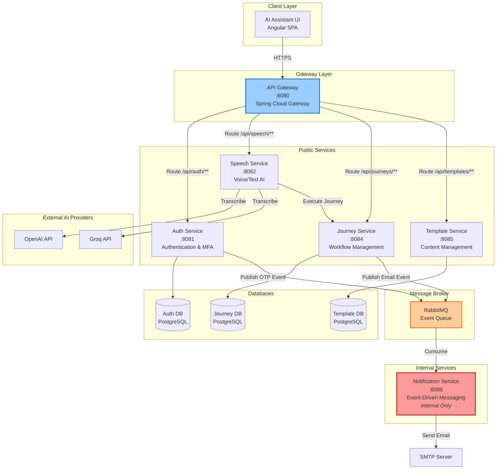
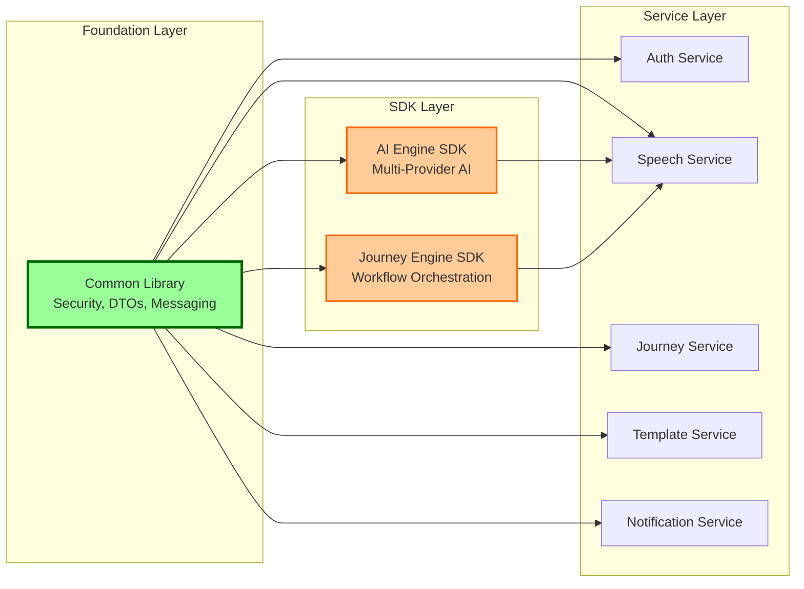
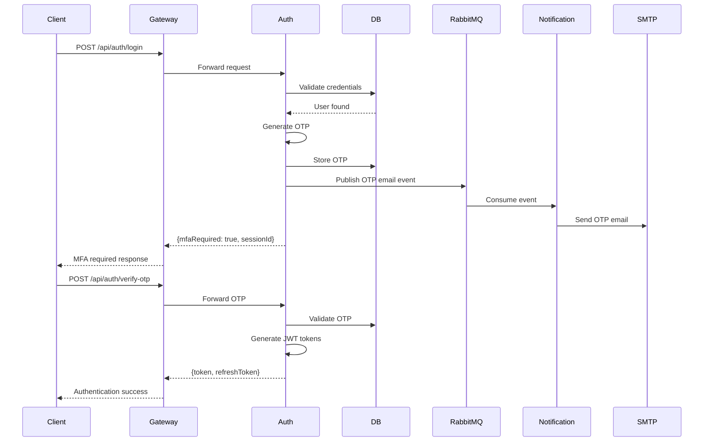
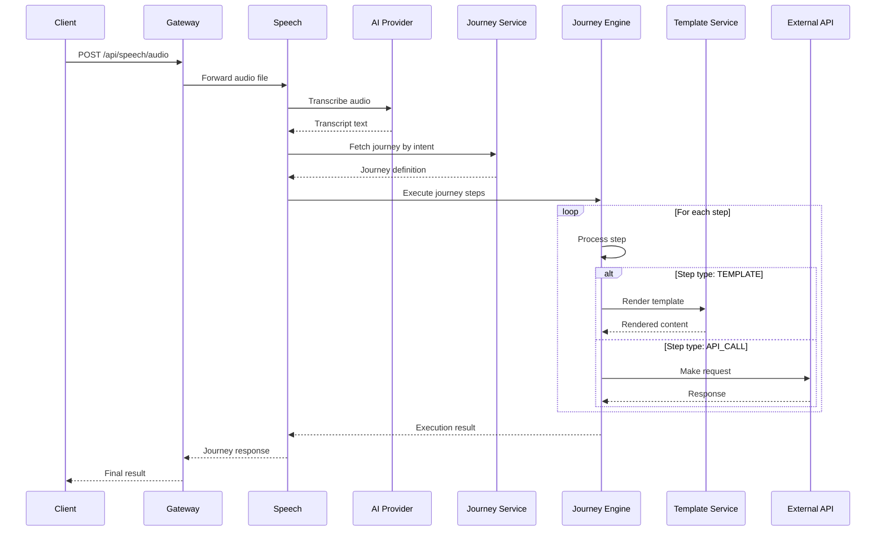

# AI Assistant Platform - Architecture Documentation

> **Version:** 1.0.0  
> **Last Updated:** February 2026  
> **Platform:** Microservices-based AI Orchestration Platform

---

## 📋 Table of Contents

1. [Overview](#overview)
2. [High-Level Architecture](#high-level-architecture)
3. [Core Components](#core-components)
4. [SDKs & Libraries](#sdks--libraries)
5. [Service Communication](#service-communication)
6. [Installation Guide](#installation-guide)
7. [Deployment Guide](#deployment-guide)
8. [Technology Stack](#technology-stack)

---

## Overview

The AI Assistant Platform is a sophisticated microservices ecosystem designed to orchestrate conversational AI workflows, manage multi-step journeys, and deliver intelligent, context-aware responses through voice and text interfaces.

### Key Capabilities

- 🎯 **Multi-Provider AI Integration** - Seamless switching between OpenAI, Groq, and other AI providers
- 🔄 **Stateful Journey Orchestration** - Complex, resumable workflow execution
- 🔐 **Enterprise Security** - JWT-based authentication with MFA support
- 📧 **Event-Driven Notifications** - Asynchronous messaging via RabbitMQ
- 🎤 **Voice & Text Processing** - Unified interface for audio transcription and text analysis

---

## High-Level Architecture



---

## Core Components

### 1. API Gateway
**Port:** 8080  
**Technology:** Spring Cloud Gateway (Reactive)

Central entry point for all client requests. Handles routing, CORS, and pre-flight requests.

**Routing Table:**

| Path Pattern | Target Service | Port |
|--------------|----------------|------|
| `/api/auth/**` | Auth Service | 8081 |
| `/api/speech/**` | Speech Service | 8082 |
| `/api/journeys/**` | Journey Service | 8084 |
| `/api/templates/**` | Template Service | 8085 |

---

### 2. Auth Service
**Port:** 8081  
**Database:** PostgreSQL

Manages user authentication, multi-factor authentication (MFA), and JWT token lifecycle.

**Key Features:**
- User registration and login
- Email-based OTP verification
- Access/refresh token management
- Password reset flows

---

### 3. Speech Service
**Port:** 8082  
**Dependencies:** AI Engine SDK, Journey Engine SDK

Orchestrates voice and text-based conversational workflows.

**Key Features:**
- Audio transcription (multi-provider)
- Journey execution from natural language
- AI-powered journey generation
- Session management for multi-turn conversations

---

### 4. Journey Service
**Port:** 8084  
**Database:** PostgreSQL

Manages conversational journey definitions and metadata.

**Key Features:**
- Journey CRUD operations
- Multi-lookup (ID, slug, code, intent)
- Visual builder integration
- Template rendering support

---

### 5. Template Service
**Port:** 8085  
**Database:** PostgreSQL

Manages FreeMarker templates for dynamic content generation.

**Key Features:**
- Template CRUD operations
- Pagination and filtering
- FreeMarker rendering
- Journey integration

---

### 6. Notification Service (Internal)
**Port:** 8086  
**Type:** Internal API (Not exposed via Gateway)

> ⚠️ **Internal Service**: This service is NOT exposed through the API Gateway and should only be accessed via RabbitMQ events.

Event-driven notification delivery via email and SMS.

**Key Features:**
- RabbitMQ consumer for notification events
- Dynamic SMTP configuration
- Email delivery with retry logic
- Extensible SMS provider interface

---

## SDKs & Libraries

### Core Libraries



### 1. Common Library
**Artifact:** `common-lib-1.0.0.jar`

Shared infrastructure for all microservices.

**Modules:**
- `@EnableCommon` - Core DTOs and exception handlers
- `@EnableCustomSecurity` - JWT and OTP utilities
- `@EnableFreeMarker` - Template engine configuration
- `@EnableNotificationMessaging` - RabbitMQ integration

---

### 2. AI Engine SDK
**Artifact:** `ai-engine-sdk-1.0.0.jar`

Multi-provider AI integration layer.

**Features:**
- Chat completion (OpenAI, Groq)
- Audio transcription
- JSON value extraction
- Provider abstraction via `AiAgent` interface

**Activation:**
```java
@EnableAi
@SpringBootApplication
public class Application { }
```

---

### 3. Journey Engine SDK
**Artifact:** `journey-engine-sdk-1.0.0.jar`

Stateful workflow orchestration engine.

**Features:**
- Step-by-step execution with context preservation
- Resumable journeys (WAITING state)
- Branching and conditional logic
- Extensible step handlers (API, Mail, Template, etc.)

**Activation:**
```java
@EnableJourneyEngine
@SpringBootApplication
public class Application { }
```

---

## Service Communication

### Authentication Flow



---

### Journey Execution Flow



---

## Installation Guide

### Prerequisites

- **Java 21** or higher
- **Maven 3.8+**
- **PostgreSQL 14+**
- **Docker** (for RabbitMQ)
- **Node.js 18+** (for UI)

---

### Step 1: Install Core Dependencies

> ⚠️ **Important**: Install in this exact order to satisfy dependency hierarchy.

#### 1.1 Install Common Library

```bash
cd ai-assistant-api/common-lib
mvn clean install
```

**Expected Output:**
```
[INFO] Installing common-lib-1.0.0.jar to local repository
[INFO] BUILD SUCCESS
```

---

#### 1.2 Install AI Engine SDK

```bash
cd ../ai-engine-sdk
mvn clean install
```

**Expected Output:**
```
[INFO] Installing ai-engine-sdk-1.0.0.jar to local repository
[INFO] BUILD SUCCESS
```

---

#### 1.3 Install Journey Engine SDK

```bash
cd ../journey-engine-sdk
mvn clean install
```

**Expected Output:**
```
[INFO] Installing journey-engine-sdk-1.0.0.jar to local repository
[INFO] BUILD SUCCESS
```

---

### Step 2: Database Setup

#### 2.1 Create Databases

```sql
-- Connect to PostgreSQL
psql -U postgres

-- Create databases
CREATE DATABASE auth_db;
CREATE DATABASE journey_db;
CREATE DATABASE template_db;

-- Create user (optional)
CREATE USER ai_assistant WITH PASSWORD 'your_secure_password';
GRANT ALL PRIVILEGES ON DATABASE auth_db TO ai_assistant;
GRANT ALL PRIVILEGES ON DATABASE journey_db TO ai_assistant;
GRANT ALL PRIVILEGES ON DATABASE template_db TO ai_assistant;
```

---

#### 2.2 Configure Database Connections

Update `application.properties` for each service:

**Auth Service:**
```properties
spring.datasource.url=jdbc:postgresql://localhost:5432/auth_db
spring.datasource.username=ai_assistant
spring.datasource.password=your_secure_password
spring.jpa.hibernate.ddl-auto=update
```

**Journey Service:**
```properties
spring.datasource.url=jdbc:postgresql://localhost:5432/journey_db
spring.datasource.username=ai_assistant
spring.datasource.password=your_secure_password
spring.jpa.hibernate.ddl-auto=update
```

**Template Service:**
```properties
spring.datasource.url=jdbc:postgresql://localhost:5432/template_db
spring.datasource.username=ai_assistant
spring.datasource.password=your_secure_password
spring.jpa.hibernate.ddl-auto=update
```

---

### Step 3: RabbitMQ Setup

#### 3.1 Install RabbitMQ with Docker

```bash
# Pull RabbitMQ image with management plugin
docker pull rabbitmq:3-management

# Run RabbitMQ container
docker run -d \
  --name rabbitmq \
  -p 5672:5672 \
  -p 15672:15672 \
  -e RABBITMQ_DEFAULT_USER=admin \
  -e RABBITMQ_DEFAULT_PASS=admin123 \
  rabbitmq:3-management
```

---

#### 3.2 Verify RabbitMQ Installation

```bash
# Check container status
docker ps | grep rabbitmq

# Access management UI
# Open browser: http://localhost:15672
# Login: admin / admin123
```

---

#### 3.3 Configure RabbitMQ in Services

Update `application.properties` for services using RabbitMQ:

**Auth Service & Notification Service:**
```properties
spring.rabbitmq.host=localhost
spring.rabbitmq.port=5672
spring.rabbitmq.username=admin
spring.rabbitmq.password=admin123
```

---

### Step 4: Build All Services

```bash
# Build all services
cd ai-assistant-api

# Build each service
mvn clean package -pl api-gateway
mvn clean package -pl auth-service
mvn clean package -pl speech-service
mvn clean package -pl journey-service
mvn clean package -pl template-service
mvn clean package -pl notification-service
```

---

## Deployment Guide

### Starting Services

> 💡 **Tip**: Start services in this order to ensure proper dependency resolution.

#### 1. Start Infrastructure

```bash
# Ensure PostgreSQL is running
sudo systemctl start postgresql

# Ensure RabbitMQ is running
docker start rabbitmq
```

---

#### 2. Start Core Services

```bash
# Terminal 1: API Gateway
cd api-gateway
mvn spring-boot:run

# Terminal 2: Auth Service
cd auth-service
mvn spring-boot:run

# Terminal 3: Journey Service
cd journey-service
mvn spring-boot:run

# Terminal 4: Template Service
cd template-service
mvn spring-boot:run
```

---

#### 3. Start AI Services

```bash
# Terminal 5: Speech Service
cd speech-service
export AI_PROVIDER=GROQ
export GROQ_API_KEY=your_groq_api_key
mvn spring-boot:run
```

---

#### 4. Start Internal Services

```bash
# Terminal 6: Notification Service
cd notification-service
mvn spring-boot:run
```

---

### Verification

#### Health Checks

```bash
# API Gateway
curl http://localhost:8080/actuator/health

# Auth Service
curl http://localhost:8081/api/auth/health

# Journey Service
curl http://localhost:8084/api/journeys

# Template Service
curl http://localhost:8085/api/templates
```

---

#### RabbitMQ Queue Verification

1. Open RabbitMQ Management UI: http://localhost:15672
2. Navigate to **Queues** tab
3. Verify `notifications` queue exists
4. Check consumer count (should be 1 when Notification Service is running)

---

## Technology Stack

### Backend

| Technology | Version | Purpose |
|------------|---------|---------|
| Java | 21 | Core language |
| Spring Boot | 3.2.2 | Application framework |
| Spring Cloud Gateway | 2023.0.0 | API Gateway |
| Spring Security | 6.x | Authentication & Authorization |
| Spring Data JPA | 3.x | Database ORM |
| PostgreSQL | 14+ | Relational database |
| RabbitMQ | 3.x | Message broker |
| FreeMarker | 2.3.x | Template engine |
| MapStruct | 1.5.5 | DTO mapping |

### Frontend

| Technology | Version | Purpose |
|------------|---------|---------|
| Angular | 17.x | SPA framework |
| TypeScript | 5.x | Type-safe JavaScript |
| RxJS | 7.x | Reactive programming |

### External Integrations

| Service | Purpose |
|---------|---------|
| OpenAI API | AI chat and transcription |
| Groq API | High-speed AI inference |
| SMTP Servers | Email delivery |

---

## License

Copyright © 2024 ITWays. All rights reserved.
